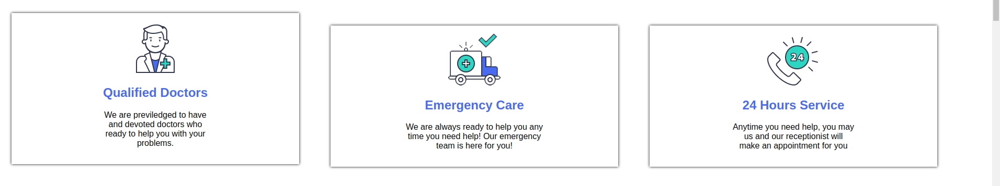

# Medic Care Clinic
---
## Project description
---
Medic care Clinic is website for innovative company that clients visits to learn the services offered by different professional doctors.

Here is an outlook of the website
<!--  -->

---

## Tecnologies used
* HTML5
* css
---
---
## Project setup and installation
1. Open the terminal and navigate to where you to open the project e.g `cd Desktop`
2. To clone the the project paste this in the terminal`git clone https://github.com/Bathenal/Medic-Care-Clinic.git`
3. Use `Cd Medic-Care-Clinic` to get into the project directory
4. Open the project with your favorite web browser

## live link
To acess the project use this [link](https://bathenal.github.io/Medic-Care-Clinic/)
---
## Contact
If you like to contribute, get in touch through 
[email](https://mail.google.com/mail/u/0/#inbox?compose=new)

## License
MIT License

Copyright (c) [2024] [***BOAZ***]

Permission is hereby granted, free of charge, to any person obtaining a copy
of this software and associated documentation files (the "Software"), to deal
in the Software without restriction, including without limitation the rights
to use, copy, modify, merge, publish, distribute, sublicense, and/or sell
copies of the Software, and to permit persons to whom the Software is
furnished to do so, subject to the following conditions:

The above copyright notice and this permission notice shall be included in all
copies or substantial portions of the Software.

THE SOFTWARE IS PROVIDED "AS IS", WITHOUT WARRANTY OF ANY KIND, EXPRESS OR
IMPLIED, INCLUDING BUT NOT LIMITED TO THE WARRANTIES OF MERCHANTABILITY,
FITNESS FOR A PARTICULAR PURPOSE AND NONINFRINGEMENT. IN NO EVENT SHALL THE
AUTHORS OR COPYRIGHT HOLDERS BE LIABLE FOR ANY CLAIM, DAMAGES OR OTHER
LIABILITY, WHETHER IN AN ACTION OF CONTRACT, TORT OR OTHERWISE, ARISING FROM,
OUT OF OR IN CONNECTION WITH THE SOFTWARE OR THE USE OR OTHER DEALINGS IN THE
SOFTWARRE